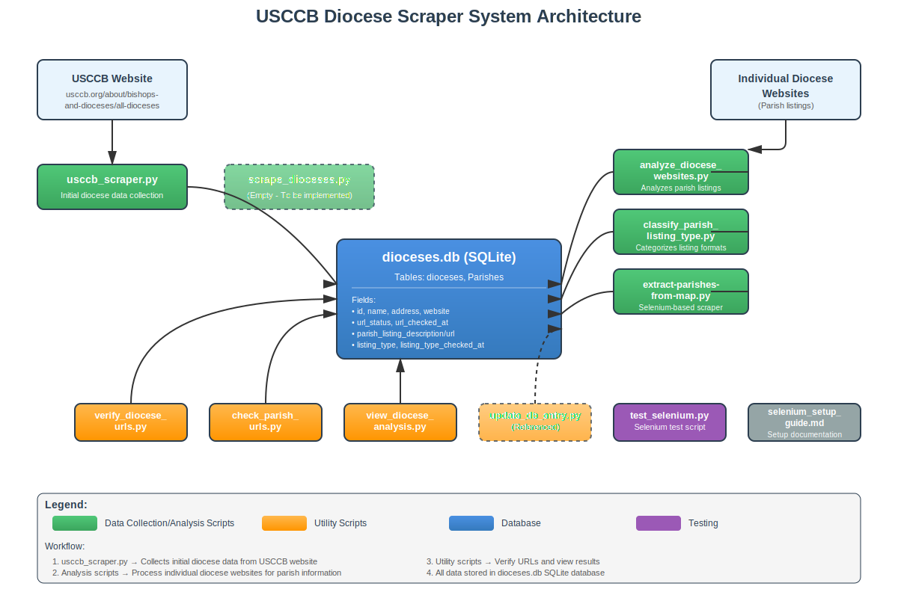

# USCCB Diocese Scraper and Analysis Tool

This project provides a set of Python scripts to scrape information about dioceses from the United States Conference of Catholic Bishops (USCCB) website, analyze their individual websites, and manage the collected data in a SQLite database.

## Features

- **USCCB Scraper:** Scrapes initial diocese information from the USCCB website.
- **Diocese Website Scraper:** Gathers more detailed information directly from individual diocese websites.
- **URL Verification:** Verifies the validity and accessibility of diocese website URLs.
- **Website Analysis:** Analyzes the content of diocese websites.
- **Database Management:** Stores and manages scraped and analyzed data in a `dioceses.db` SQLite database.
- **Data Viewing:** Provides a utility to view the results of the diocese analysis.

## Project Structure

- `usccb_scraper.py`: Script to scrape initial diocese data from USCCB.
- `scrape_dioceses.py`: Script to scrape detailed information from individual diocese websites.
- `analyze_diocese_websites.py`: Script for analyzing the content of scraped diocese websites.
- `verify_diocese_urls.py`: Script to verify the URLs of diocese websites.
- `update_db_entry.py`: Utility to update entries within the `dioceses.db` database.
- `view_diocese_analysis.py`: Script to view the analysis results stored in the database.
- `extract-parishes-from-map.py`: Script to extract parish information from a map-based parish finder.
- `dioceses.db`: SQLite database file where all collected and analyzed data is stored.

## System Architecture




## Setup and Installation

1.  **Clone the repository:**

    ```bash
    git clone https://github.com/your-username/USCCB2.git
    cd USCCB2
    ```

2.  **Create a virtual environment (recommended):**

    ```bash
    python3 -m venv venv
    source venv/bin/activate
    ```

3.  **Install dependencies:**

    (You will need to install the required Python packages. A `requirements.txt` file is typically used for this. If one doesn't exist, you'll need to identify and install them manually, e.g., `pip install requests beautifulsoup4 lxml`) 

    ```bash
    # Example (replace with actual dependencies)
    pip install requests beautifulsoup4 lxml
    ```

## Usage

Each script can be run independently. Here's a general workflow:

1.  **Initial Scrape:** Run `usccb_scraper.py` to populate the database with basic diocese information.

    ```bash
    python usccb_scraper.py
    ```

2.  **Detailed Scrape:** Run `scrape_dioceses.py` to gather more in-depth data from individual diocese websites.

    ```bash
    python scrape_dioceses.py
    ```

3.  **Verify URLs:** Use `verify_diocese_urls.py` to check the validity of the collected URLs.

    ```bash
    python verify_diocese_urls.py
    ```

4.  **Analyze Websites:** Execute `analyze_diocese_websites.py` to perform content analysis on the websites.

    ```bash
    python analyze_diocese_websites.py
    ```

5.  **View Analysis:** Use `view_diocese_analysis.py` to inspect the results.

    ```bash
    python view_diocese_analysis.py
    ```

6.  **Update Database Entries:** If needed, use `update_db_entry.py` to manually update specific records.

    ```bash
    python update_db_entry.py
    ```

7.  **Extract Parishes from Map:** Use `extract-parishes-from-map.py` to scrape parish data from a map-based interface. By default, it will extract 5 parishes.

    ```bash
    python extract-parishes-from-map.py
    ```

    You can specify the number of parishes to scrape using the `--max-parishes` argument.

    ```bash
    python extract-parishes-from-map.py --max-parishes 10
    ```

## Database (`dioceses.db`)

The `dioceses.db` file is a SQLite database that stores all the scraped and analyzed data. You can interact with it using any SQLite browser or through Python's `sqlite3` module.